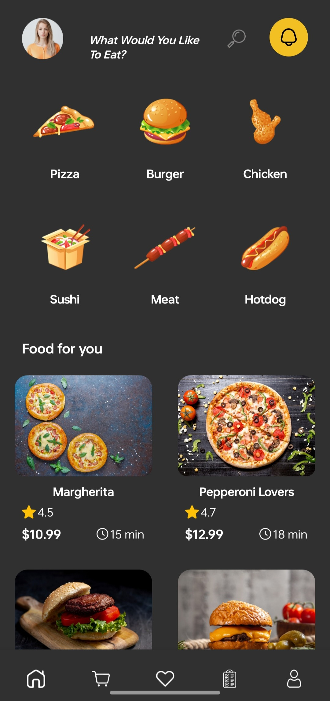
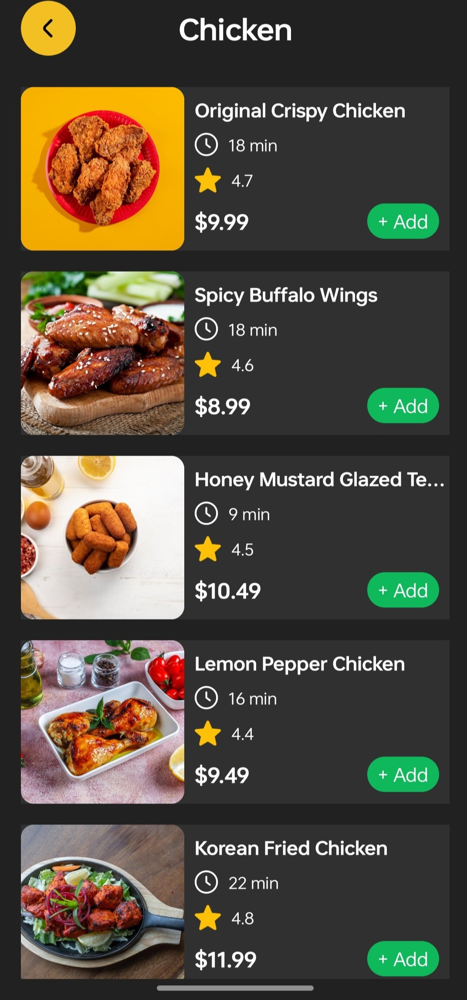
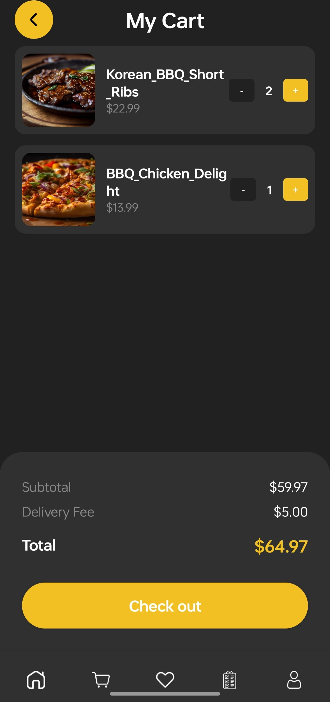
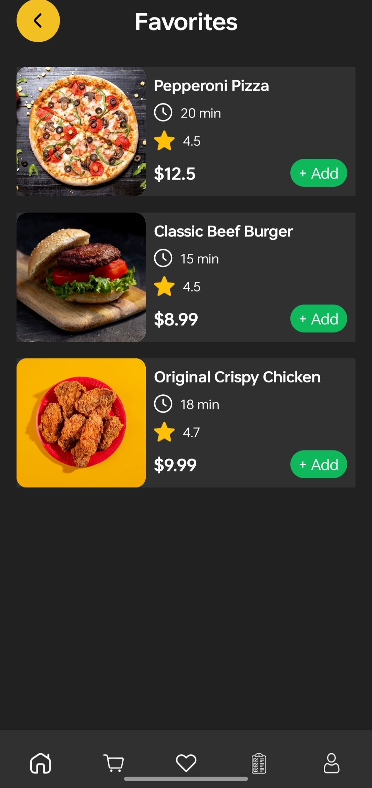
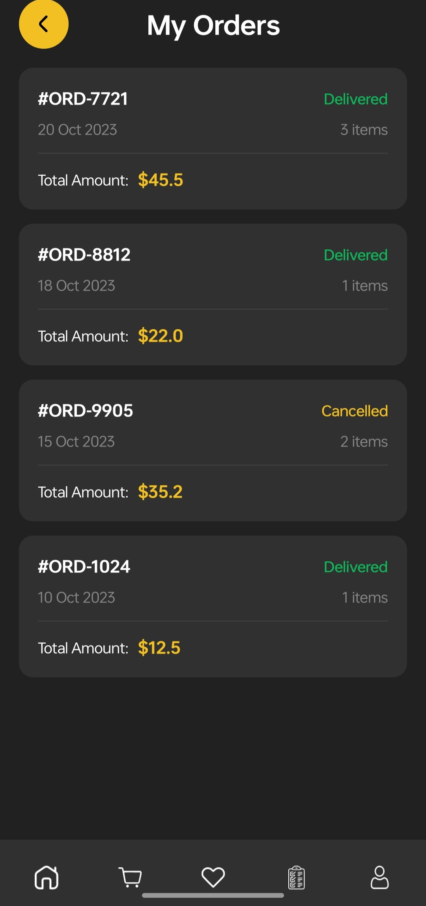
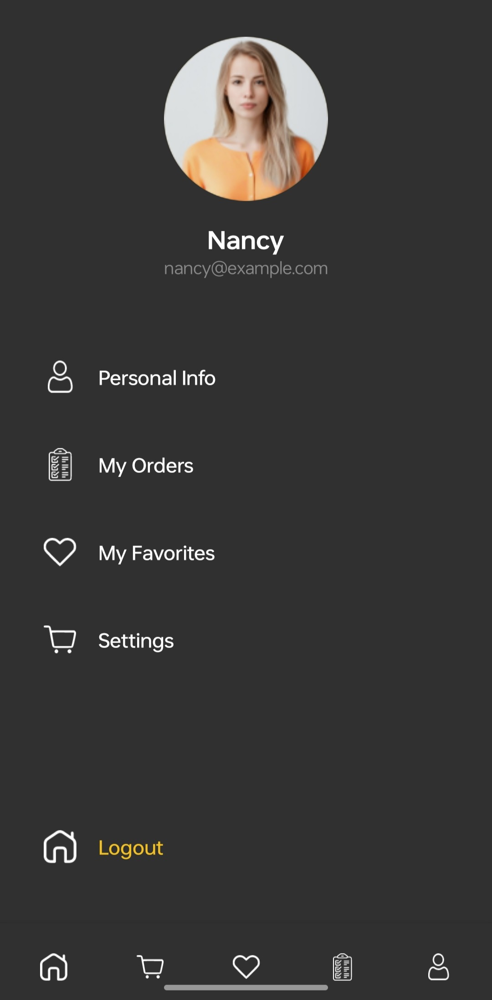

FOOD ORDERING APP

A modern food ordering app in Jetpack Compose features a declarative UI, integrating MVVM architecture, Firebase/Retrofit backend, and Material 3 design.
Key features include user authentication, interactive restaurant browsing, realtime cart management, payment integration  and live order tracking.

Core Functional Features:

Authentication:

Secure Login/Sign-up using email, Google.

Home/Discovery:

Dynamic menus, category filtering, and nearby restaurant listings.

Cart Management:

Real-time cart updates, item customization, and quantity steppers.

Payment & Checkout: 

Multiple payment options (Stripe/Cash on Delivery).

Order Tracking: 

Live tracking with Google Maps API and push notifications.

User Profiles:

Order history, saved addresses, and reviews.

HOMESCREEN, CARTSSCREEN & FAVORITESCREEN 

   

ORDERSSCREEN                     &                        PROFILESCREEN

           

